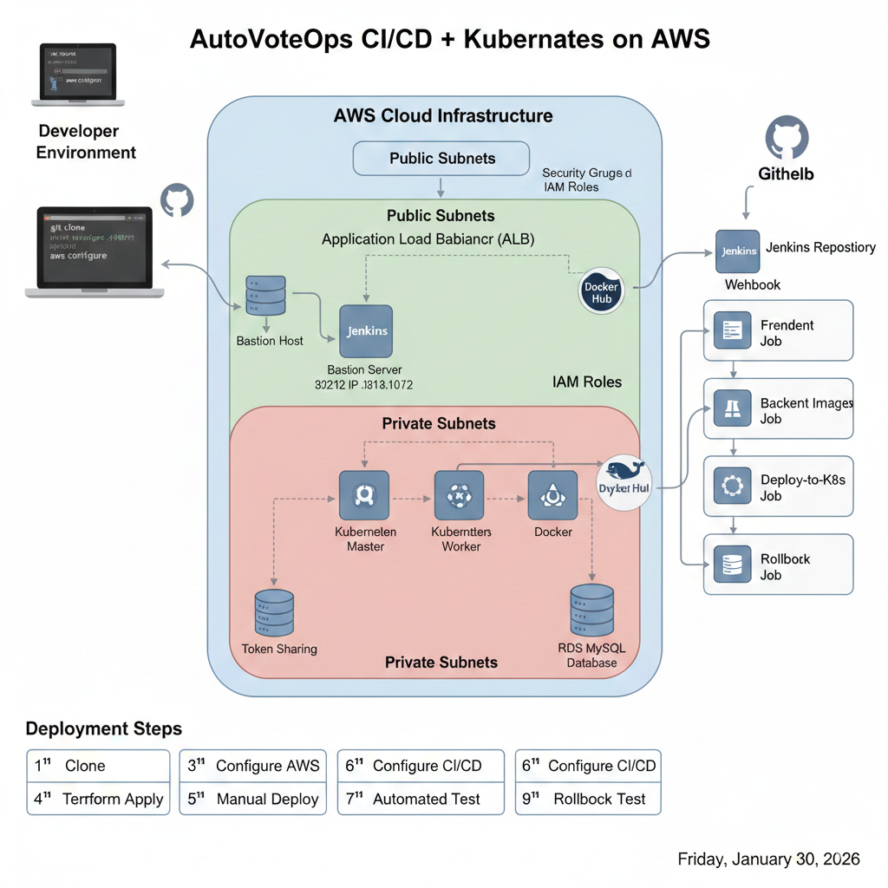

# AutoVoteOps: Production-Grade CI/CD Pipeline

## 🌟 Overview
**AutoVoteOps** is a **production‑grade DevOps automation project** that demonstrates how to design, deploy, and operate a fully automated CI/CD pipeline on AWS using **Infrastructure as Code (IaC), Containerization, and Kubernetes Orchestration**.

The project provisions cloud infrastructure from scratch, builds and versions Docker images, deploys applications to Kubernetes, supports **automated rollouts**, and enables **one‑click rollback** to previous versions.

- **Infrastructure as Code** using Terraform
- **Container orchestration** with Kubernetes (kubeadm cluster)
- **Automated CI/CD** pipelines with Jenkins
- **Microservices architecture** deployed on AWS
- **Database management** with AWS RDS MySQL
- **Automated cluster setup** with custom AMI, Shellscripting and S3 token sharing

### What This Project Demonstrates

✅ **Complete DevOps Lifecycle** - From infrastructure provisioning to application deployment  
✅ **Cloud-Native Architecture** - Microservices running on Kubernetes  
✅ **Automation** - Terraform for infrastructure, Jenkins for CI/CD  
✅ **Security Best Practices** - Private subnets, security groups, IAM roles  
✅ **Scalability** - Kubernetes deployments with replica management  
✅ **Real-World Patterns** - NAT Gateway, bastion host, RDS, container registry

## 🧱 Architecture Diagram




### 🔹 Architecture Flow

1. Developer pushes code to GitHub

2. GitHub Webhook triggers Jenkins jobs

3. Jenkins builds Docker images on a dedicated Docker Builder EC2

4. Images are pushed to Docker Hub with version tags

5. Jenkins deploys updated images to Kubernetes (EC2‑based cluster)

6. Application connects securely to RDS MySQL

7. Traffic is routed via ALB DNS

8. Rollback job allows reverting to previous stable versions

---

## 🛠️ Tech Stack

### Infrastructure & Cloud
- **Cloud Provider:** AWS (EC2, VPC, RDS, S3, NAT Gateway)
- **IaC:** Terraform
- **AMI Building:** Packer (Jenkins.java,docker,kubeadm installation through AMI Packer)
- **Container Orchestration:** Kubernetes (kubeadm)
- **Networking:** VPC, Subnets, Security Groups, Route Tables
- ALB: For traffic distribution

### Application
- **Frontend:** index.html,style.css
- **Backend:** server.js,package.json,.env
- **Database:** MySQL (AWS RDS)
- **Containerization:** Docker
- **Reverse Proxy:** Nginx

### CI/CD & Automation
- **CI/CD:** Jenkins (Multi-job pipeline)
- **Version Control:** Git, GitHub
- **Container Registry:** DockerHub
- **Automation Scripts:** Bash, Shell scripts

### Kubernetes Components
- **CNI:** Calico Network
- **Service Types:** ClusterIP, NodePort
- **Workloads:** Deployments, Pods
- **Config Management:** ConfigMaps, Secrets

---

## 🚀 Features

### Application Features
- **Dual-Option Interactive Voting**: Simple, intuitive "Team A" vs. "Team B" buttons for instant user engagement.
- **Dynamic Progress Visuals**: Real-time progress bars that visually compare the vote distribution between the two teams.
- **Live Leaderboard**: A stats section that displays the exact numerical vote count for each team.
- **Winner Declaration**: A reactive header that automatically updates to announce which team is currently in the lead or if the results are tied.


### DevOps Features
- 🏗️ **Infrastructure as Code** - Complete infrastructure defined in Terraform
- 🐳 **Containerized Services** - All services run in Docker containers
- ☸️ **Kubernetes Orchestration** - Automated deployment and scaling
- 🔄 **CI/CD Automation** - Automated build and deployment pipeline
- 🔒 **Security Best Practices** - Private subnets, security groups, secrets management
- 📊 **High Availability** - Multiple pod replicas, health checks
- 🔧 **Easy Rollback** - One-click rollback to previous version
- 📈 **Scalability** - Horizontal pod scaling capability
- 🌐 **Network Isolation** - Public/private subnet architecture
- 🔑 **Token-Based Authentication** - S3-based cluster token sharing

## 📋 Prerequisites

### Local Setup
- Terraform
- AWS CLI configured
- Git
### AWS Account
- AWS account with appropriate permissions
- IAM user with appropriate access 
- AWS CLI configured with credentials

### Tools & Services
- GitHub account
- DockerHub account
- SSH key pair for EC2 access

---

## ⚡ Implementation Steps


### 1. Clone the Repository

```bash
git clone https://github.com/sayaliparhar/AutoVoteOps.git
cd AutoVoteOps
```
---
### 2. Setup AWS Credentials

```bash
Setup AWS credentials using aws configure
 aws configure
# Enter your AWS Access Key ID
# Enter your AWS Secret Access Key
# Default region: ap-south-1
# Default output format: json
```
---

### 3. Deploy Infrastructure

```bash
cd Terraform
terraform init
terraform plan
terraform apply -auto-approve
```
**🏗️ This will create following resources**:
- Networking: VPC with Public & Private Subnets.

- Compute: 4 EC2 Instances (K8s Master, K8s Worker, Jenkins Server, Docker Builder).

- Database: RDS MySQL instance.

- Storage: S3 bucket for token sharing.

- Security: IAM Roles and Security Groups.
----
### 4. Manual Bootstrapping (One-Time Setup)
⚠️ Note: These steps are only required for the very first deployment to establish the baseline.

🔹 Step 1: Push Docker Images
- SSH into the Docker Builder instance via the Bastion Host.

- Clone the git repo 
    ```bash
    git clone https://github.com/sayaliparhar/AutoVoteOps.git
    cd AutoVoteOps
    ```
- Login to Docker Hub using a Personal Access Token (PAT).

- Build and push the frontend and backend images.

🔹 Step 2: Verify Kubernetes Cluster
- SSH into the K8s Master and run:

    ```bash
    kubectl get nodes
    kubectl get pods -n kube-system
    ```
- Ensure all nodes are Ready before proceeding.

🔹 Step 3: Verify Kubernetes Worker
- SSH into the K8s Worker and run:

    ```bash
    sudo crictl pods
    ```
- Ensure all pods are Ready before proceeding.

🔹 Step 4: Initial K8s Deployment
- On the K8s Master, prepare the environment for Jenkins agents:

    ```bash
    git clone https://github.com/sayaliparhar/AutoVoteOps.git
    mv AutoVoteOps/k8s /home/ubuntu/
    ```
- Deploy the resources in order: **Namespace ➔ Secrets ➔ ConfigMaps ➔ Backend ➔ Frontend**.

---
### 5. Setup Jenkins

```bash
# Get Jenkins URL
JENKINS_IP=$(terraform output -raw jenkins_public_ip)
echo "Jenkins URL: http://${JENKINS_IP}:8080"

# Get initial admin password
ssh -i your-key.pem ubuntu@${JENKINS_IP} \
  "sudo cat /var/lib/jenkins/secrets/initialAdminPassword"
```
🔹 Step 1: Jenkins Setup
- Install Suggested Plugins.

- Add Docker Hub Credentials in Manage Jenkins > Credentials.

- Configure Agents: Add nodes for docker-builder and k8s-master using their respective labels. (for correct labels you can check respective jenkins-file.)

🔹 Step 2: Create Jobs

| Job Name        | Trigger                  | Description                                      |
|-----------------|--------------------------|--------------------------------------------------|
| Frontend-Job    | GitHub Webhook           | Builds and pushes the frontend Docker image      |
| Backend-Job     | GitHub Webhook           | Builds and pushes the backend Docker image       |
| Deploy-to-K8s   | Post-build (chained)     | Deploys updated images to Kubernetes             |
| Rollback-Job    | Manual (parameterized)   | Rolls back deployments to a selected version     |

---

### 6. GitHub Webhook Integration
- To enable automated deployments:

- Navigate to your GitHub Repo Settings > Webhooks.

- Payload URL: http://<jenkins-ip>:8080/github-webhook/

- Content type: application/json

---

### 7. Verification & Automation
1. **Test Auto-Deploy**: Push a change to the code. Jenkins will trigger the build, push the image, and update the K8s pods automatically.

2. **Verify Pods**:
    ```bash
    kubectl get pods -n <namespace>
    kubectl rollout history deployment <deployment-name>
    ```
3. **Test Rollback**: Run the Rollback-Job in Jenkins, select the previous version, and verify the app reverts to its prior state.

---

## 📈 Future Roadmap
- [ ] **Scalability:** Migrate from Kubeadm to **AWS EKS** for a managed, production-ready Control Plane.
- [ ] **Observability:** Integrate **Prometheus and Grafana** for real-time monitoring and alerting.
- [ ] **GitOps:** Transition to **ArgoCD** to automate deployment synchronization directly from Git.
- [ ] **Security:** Implement **HashiCorp Vault** for centralized and encrypted secret management.

---

## 👥 Authors

- **Sayali Parhar** - *Initial work* - [YourGitHub](https://github.com/sayaliparhar)

---


